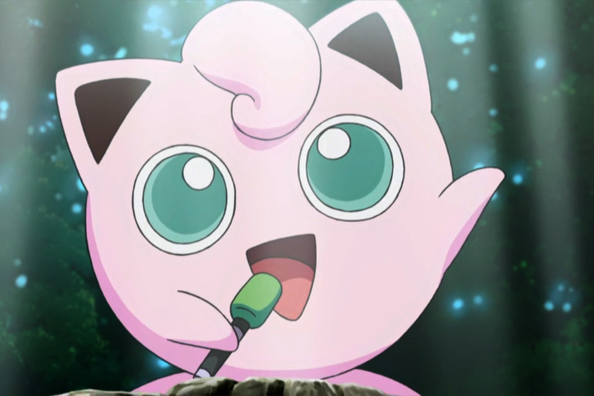

# Jigglypuff

Jigglypuff is a small, balloon-like Pokémon with big, expressive eyes. It's characterized by its soft, pink skin and its round, puffy appearance. Jigglypuff is known for its musical talent, particularly its ability to sing a soothing lullaby. However, the sound waves produced by its song can also induce sleep in those who listen to it, causing them to doze off.

While Jigglypuff is friendly and social, it carries a marker that it uses to draw on the faces of people or other Pokémon who fall asleep during its performances, often leaving them with funny, temporary doodles. Jigglypuff can evolve from Igglybuff and further evolve into Wigglytuff, gaining more power and strength along the way.

In the world of Pokémon, Jigglypuff is known for its unique ability to sing and its cute, round appearance, making it a memorable and endearing creature.